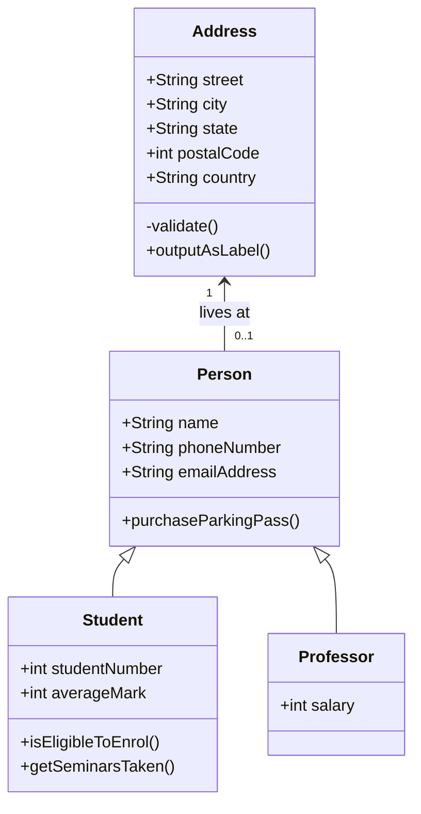
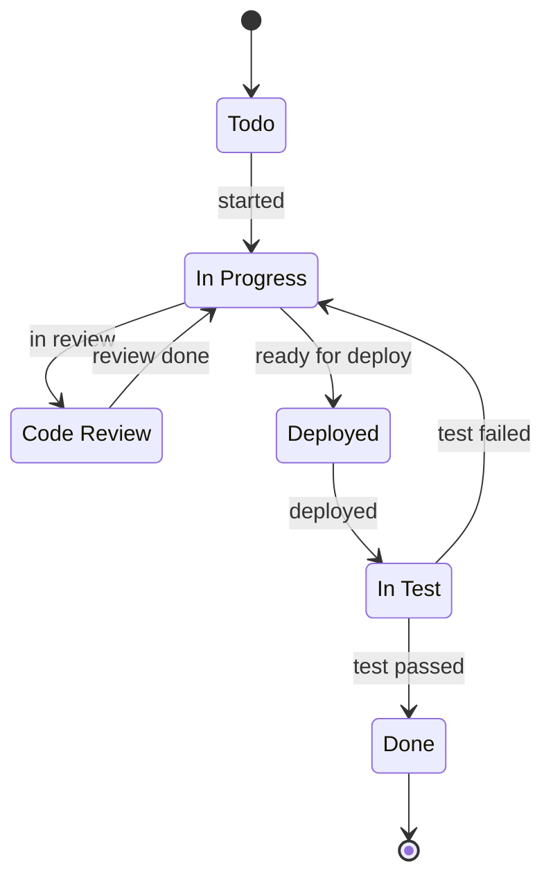
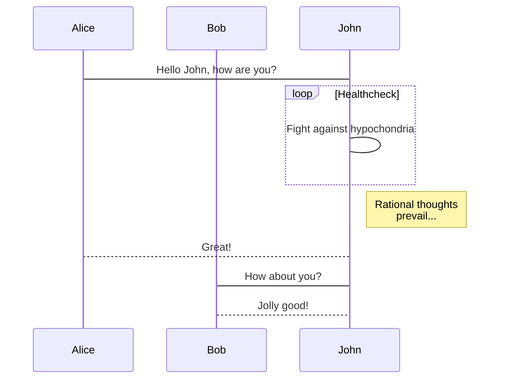
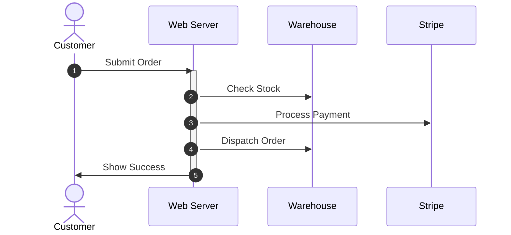

# Example: Supermarket REST API

adapted from this [medium-article](https://medium.com/free-code-camp/an-awesome-guide-on-how-to-build-restful-apis-with-asp-net-core-87b818123e28) for now.

## Aim

A practical approach to improve my understanding of RESTful APIs and C#.  

## Background: REST-ful API

REST - Representational State Transfer:
- This distributed architecture is used to communicate between clients and a server.  
- The API centralizes data which different client applications can access using HTTP.  
- Universal Resource Indicators (URIs), HTTP verbs and api end points `/api/point`.
- Conceptualized by Roy Fielding in 2000
  
Characteristics of REST Architecture:
- Uniform Interface
- Stateless
- Client Server
- Cashable
- Layered System

## C#
 
Our goal is to build a REST API using ASP.NET Core framework

- Entity Framework Core
- AutoMapper
- Resource

In [.NET 6](https://learn.microsoft.com/en-us/aspnet/core/migration/50-to-60?source=recommendations&view=aspnetcore-7.0&tabs=visual-studio), they unified `Startup.cs` and `Program.cs` into one Program.cs.  
Now registering middleware, services and adding DbContext and everything else into the `Program.cs` file.

>An ASP.NET Core application consists of a group of [middlewares](https://learn.microsoft.com/en-us/aspnet/core/fundamentals/middleware/?view=aspnetcore-7.0&viewFallbackFrom=aspnetcore-2.2) (small pieces of the application attached to the application pipeline, that handle requests and responses) configured in the Startup class

## Scope

Let’s write a fictional web API for a supermarket. Let’s imagine we have to implement the following scope:

Create a RESTful service that allows client applications to manage the supermarket’s product catalog. It needs to expose endpoints to create, read, edit and delete products categories, such as dairy products and cosmetics, and also to manage products of these categories.
For categories, we need to store their names. For products, we need to store their names, unit of measurement (for example, KG for products measured by weight), quantity in the package (for example, 10 if the product is a pack of biscuits) and their respective categories.

### Class UML Diagram

### Flow Chart

### State Diagram

### Sequence Diagram

## Folder Structure

### Controllers

Handles HTTP request/responses between services.

### Domain

Let’s start by writing the domain layer. This layer will have our models classes, the classes that will represent our products and categories, as well as repositories and services interfaces. I’ll explain these last two concepts in a while.

#### Models

This layer will have our models classes, 
the classes that will represent our products and categories, 
as well as repositories and services interfaces.

#### Repositories

A service class is not a class that should handle data access.  
There is a pattern called Repository Pattern that is used to manage data from databases.  
Repository classes encapsulate all logic to handle data access.  
These repositories expose methods to list, create, edit and delete objects of a given model, the same way you can manipulate collections.  
Internally, these methods talk to the database to perform CRUD operations, isolating the database access from the rest of the application.

#### Persistance 

This directory is going to have everything we need to access the database, such as repositories implementations.  
Context folder AppDbContext class must inherit DbContext, a class EF Core uses to map your models to database tables.

#### Resources

A resource class is a class that contains only basic information that will be exchanged between client applications and API endpoints, generally in form of JSON data, to represent some particular information.

## Steps

- 1. Creating the API
  - create the folders structure for the web service
  - use the .NET CLI tools to scaffold a basic Web API template
  - An ASP.NET Core application consists of a group of middleware
- 2. Creating the Domain Models
  - This layer will have our models classes, the classes that will represent our products and categories, 
  - as well as repositories and services interfaces.
  - Entity Framework Core, the ORM most ASP.NET Core applications use to persist data into a database, to map the relationship between categories and products. 
- 3. The Categories API
  - Controllers services interface - request/respond
  - domain services interface - get data from db
- 4. Implementing the Categories Service
  - services implementations
  - The Categories Repository and the Persistence Layer
- 5. The Categories Repository and the Persistence Layer
  - return to category service and implement list method from ICategoryRepository interface to return data.
  - create a new directory called Persistence
  - create a new directory called Contexts
  - create class called AppDbContext
    - a class EF Core uses to map your models to database tables
  - Add a new folder called Repositories
  - add a new class called BaseRepository
  - create class CategoryRepository
- 6. Configuring Dependency Injection
  - The ConfigureServices and Configure methods are called at runtime by the framework pipeline to configure how the application should work and which components it must use.
  - MVC properties for controllers then accessing the services parameter, to configure our dependency bindings.
- 7. Testing the Categories API
  - `dotnet run`
  - test api end-point
- 8.  Creating a Category Resource

## References

- [supermarket-api](https://github.com/evgomes/supermarket-api)
- [supermarket-medium](https://medium.com/free-code-camp/an-awesome-guide-on-how-to-build-restful-apis-with-asp-net-core-87b818123e28)
- [microsoft-asp.net-api](https://learn.microsoft.com/en-us/aspnet/core/web-api/?WT.mc_id=dotnet-35129-website&view=aspnetcore-7.0)
- [charts](https://www.dandoescode.com/blog/plantuml-vs-mermaid)

i am here

https://medium.com/free-code-camp/an-awesome-guide-on-how-to-build-restful-apis-with-asp-net-core-87b818123e28

Let’s start handling GET requests. First of all, when someone requests data from /api/categories via GET verb, the API needs to return all categories. We can create a category service for this purpose.